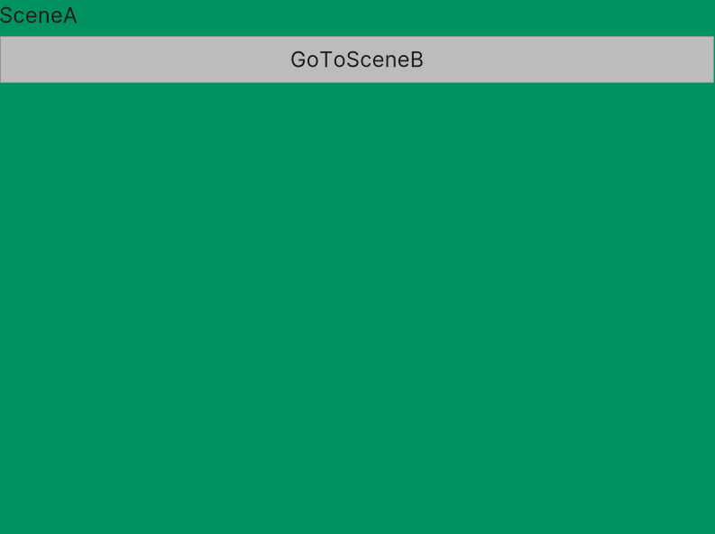

# Scene Change Animations for UIToolkit
Simply create an animation from one scene to the next using Unity's UIToolkit.

</src>

# How to Use

## Get the Package
- You can add a dependency to your `Packages/manifest.json` using a [Git URL](https://docs.unity3d.com/Documentation/Manual/upm-git.html) in the following form:
  `"com.achimmihca.scenechangeanimations": "https://github.com/achimmihca/SceneChangeAnimations.git?path=SceneChangeAnimations/Packages/com.achimmihca.scenechangeanimations#v1.0.0"`
    - Note that `#v1.0.0` can be used to specify a tag or commit hash.
- The package ships with a sample that can be imported to your project using Unity's Package Manager.

## Example

```c#
// inside some MonoBehaviour...

private void ChangeScene()
{
    // The sceneChangeAnimationControl will take a "screenshot" of the old scene,
    // then the first passed method is used to load the next scene,
    // then a VisualElement with the "screenshot" of the old scene is added,
    // and finally animated away using the second passed method.
    sceneChangeAnimationControl.AnimateChangeToScene(
        () => SceneManager.LoadScene("MyNextScene"),
        StartFadeOutAnimation);
}

private void StartFadeOutAnimation(VisualElement visualElement)
{
    // Example animation using coroutine. Could also use LeanTween or other libraries here.
    sceneChangeAnimationControl.StartCoroutine(FadeOut(visualElement));
}

private static IEnumerator FadeOut(VisualElement visualElement)
{
    return AnimationFunctions.TimeBasedAnimation(
        // Animation time in seconds
        0.5f,
        // Set opacity based on percent value of animation time.
        animTimePercent => visualElement.style.opacity = 1 - animTimePercent,
        // Remove VisualElement when animation is complete.
        () => visualElement.RemoveFromHierarchy());
}
```

## How It Works
***Render to Texture approach***
- Take "screenshot" (see below) of old scene, load new scene, add full size VisualElement with the screenshot, animate the VisualElement away (e. g. using opacity)
    - This allows for simple animations of the whole scene.
    - Tip: You can use [LeanTween](https://github.com/dentedpixel/LeanTween) or a similar library to create complex animations with little code.

Taking the "screenshot":
- A `RenderTexture` is created with the same size of the screen (`Screen.width`, `Screen.height`).
- The RenderTexture is used as `targetTexture` of a `PanelSettings` object.
- The `UIDocument` in the scene is set to use the `PanelSettings` with the RenderTexture.
    - Thus, the RenderTexture holds a "screenshot" of the UIDocument

See also the [Unity forums](https://forum.unity.com/threads/scene-transition-animation.1308786/) where this approach had been discussed.

Note that this approach should also work to animate the change from one UXML file to another on a UIDocument in a 3D scene.
However, the current implementation of this package only covers the use case of scene changes for 2D apps with a single UIDocument in it.
